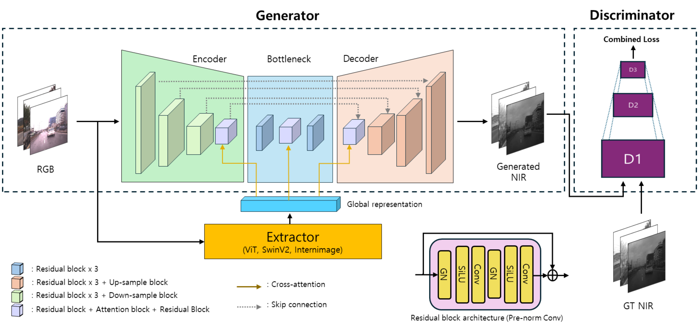
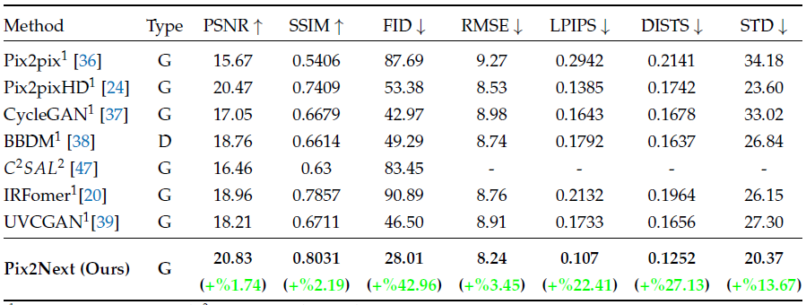
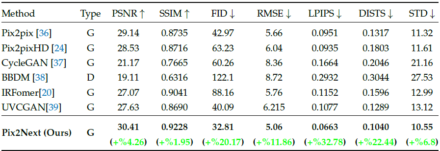
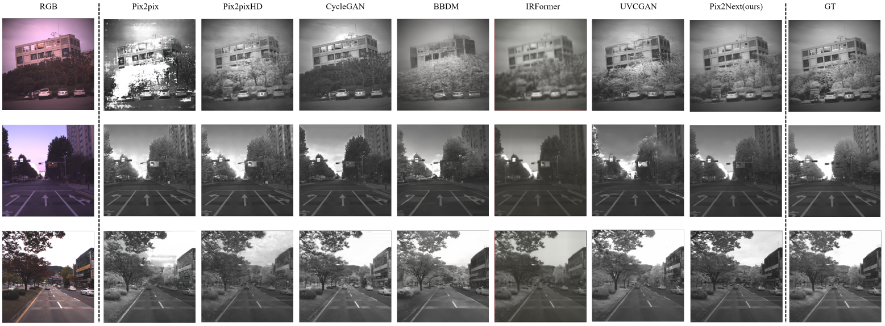
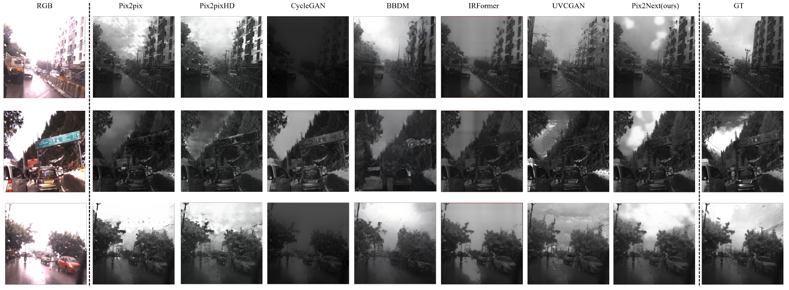
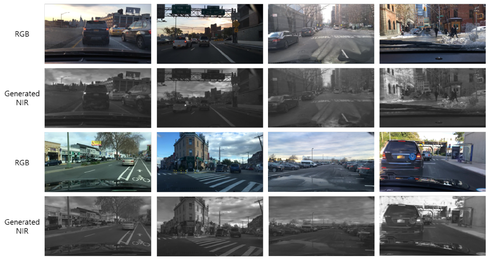

# Pix2Next: Leveraging Vision Foundation Models for RGB to NIR Image Translation

> **Pix2Next** is a novel image-to-image (I2I) translation framework that generates **Near-Infrared (NIR)** images from RGB inputs. By integrating **Vision Foundation Models (VFM)** as a feature extractor and applying **cross-attention** within an **encoder-decoder** architecture, Pix2Next delivers **high-quality**, **high-fidelity** NIR image synthesis.

<p align="center">
  
</p>


---

## Paper

- **Title**: Pix2Next: Leveraging Vision Foundation Models for RGB to NIR Image Translation  
- **Authors**: Youngwan Jin, Incheol Park, Hanbin Song, Hyeongjin Ju, Yagiz Nalcakan, Shiho Kim   
- **Paper**: [https://arxiv.org/abs/2409.16706]
- **Project page**: [https://yonsei-stl.github.io/Pix2Next/]


---

## Quick start

### Installation 
First of all install torch with the appropriate CUDA version. 
```bash
cd pix2next/common/ops_dcn3/
python setup.py build install
```
### Datasets
Dataset download
[IDD-AW](https://iddaw.github.io/)
[Ranus](https://www.chrisgchoe.com/)

Data structure
```bash
Pix2Next
├── datasets
│   ├── ranus
│   │   ├── train_A (source: RGB)
│   │   ├── train_B (target: NIR)
│   │   ├── test_A  (source: RGB)
│   │   └── test_B  (target: NIR)
│   └── idd_aw
│       ...
│       
└── ...
```

### Training 
```bash
cd ~/pix2next/UNET/trainer/
python train.py
```
---

### Testing
```bash 
cd ~/pix2next/UNET/tester/
python test_unet.py
```
---

### Evaluation 
copy from test image folder, paste to new evaluation folder 
```bash
cd ~/pix2next/UNET/evaluation/
python eval_all.py
```
---

## Performance 
### Ranus
<p align="center">
  
</p>

weight_file: [download](https://drive.google.com/file/d/1T2LGaa9DjLK69_KJOQlv0BcZaKq1uAQv/view?usp=drive_link)

### IDDAW
<p align="center">
  
</p>

weight_file: [download](https://drive.google.com/file/d/1X9p3ht9-jhYB52R9_g3Ke8wyTgAGjDkg/view?usp=sharing/)

---

## visualization 

### Ranus
<p align="center">
  
</p>

### IDDAW
<p align="center">
  
</p>

### BDD100K zeroshot translation
<p align="center">
  
</p>

## References

[RANUS: RGB and NIR Urban Scene Dataset for Deep Scene Parsing](https://ieeexplore.ieee.org/document/8279453/)

[IDD-AW: A Benchmark for Safe and Robust Segmentation of Drive Scenes in Unstructured Traffic and Adverse Weather](https://iddaw.github.io/)

[InternImage: Exploring Large-Scale Vision Foundation Models with Deformable Convolutions](https://github.com/OpenGVLab/InternImage)

## Citation 

If this work is helpful for your research, please consider citing the following BibTeX entry.
```bibtex

@article{technologies13040154,
AUTHOR = {Jin, Youngwan and Park, Incheol and Song, Hanbin and Ju, Hyeongjin and Nalcakan, Yagiz and Kim, Shiho},
TITLE = {Pix2Next: Leveraging Vision Foundation Models for RGB to NIR Image Translation},
JOURNAL = {Technologies},
VOLUME = {13},
YEAR = {2025},
NUMBER = {4},
ARTICLE-NUMBER = {154},
URL = {https://www.mdpi.com/2227-7080/13/4/154},
ISSN = {2227-7080},
DOI = {10.3390/technologies13040154}
}
```
