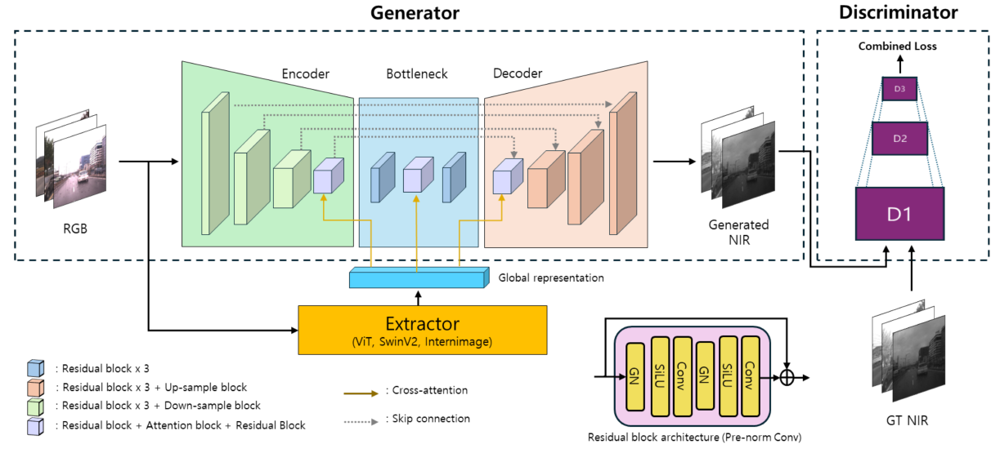

# Pix2Next: Leveraging Vision Foundation Models for RGB to NIR Image Translation

> **Pix2Next** is a novel image-to-image (I2I) translation framework that generates **Near-Infrared (NIR)** images from RGB inputs.  
> By integrating **Vision Foundation Models (VFM)** as a feature extractor and applying **cross-attention** within an **encoder-decoder** architecture, Pix2Next delivers **high-resolution**, **high-fidelity** NIR image synthesis.

<p align="center">
  
</p>


---

## Paper

- **Title**: Pix2Next: Leveraging Vision Foundation Models for RGB to NIR Image Translation  
- **Authors**: Youngwan Jin, Incheol Park, Hanbin Song, Hyeongjin Ju, Yagiz Nalcakan, Shiho Kim  
- **Journal**: *Technologies* (MDPI)  
- **PDF / DOI**: [https://arxiv.org/abs/2409.16706]  

> **Full Paper (PDF)**: [MDPI_Article_Template__2_.pdf](./MDPI_Article_Template__2_.pdf)

---

## Quick start

### Installation 
After torch install with appropriate CUDA version. 
```bash
cd pix2next/common/ops_dcn3/
python setup.py build install
```
### Datasets
Dataset download
[IDD-AW](https://iddaw.github.io/)
[Ranus](https://www.chrisgchoe.com/)

Data structure
```bash
Pix2Next
├── datasets
│   ├── ranus
│   │   ├── train_A (source: RGB)
│   │   ├── train_B (target: NIR)
│   │   ├── test_A  (source: RGB)
│   │   └── test_B  (target: NIR)
│   └── idd_aw
│       ...
│       
└── ...
```

### Training 
```bash
cd ~/pix2next/UNET/trainer/
python train.py
```
---

### Testing
```bash 
cd ~/pix2next/UNET/tester/
python test_unet.py
```
---

### Evaluation 
copy from test image folder, paste evaluation folder 
```bash
cd ~/pix2next/UNET/evaluation/
python eval_all.py
```
---

## Performance 
### Ranus
<p align="center">
  
</p>
weight_file: [Ranus_pretrain](https://drive.google.com/file/d/1X9p3ht9-jhYB52R9_g3Ke8wyTgAGjDkg/view?usp=sharing/)
[IDD-AW](https://iddaw.github.io/)
### IDDAW
<p align="center">
  
</p>
weight_file: [IDDAW_pretrain](https://drive.google.com/file/d/1X9p3ht9-jhYB52R9_g3Ke8wyTgAGjDkg/view?usp=sharing/)
---

## visualization 

### Ranus
<p align="center">
  
</p>

### IDDAW
<p align="center">
  
</p>

### BDD100K zeroshot translation
<p align="center">
  
</p>

